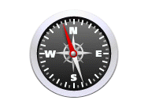
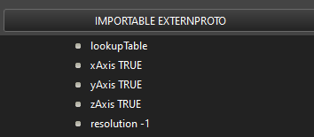
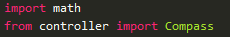
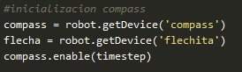
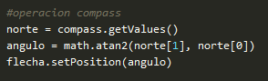

# Compass

Sensor que mide la posición relativa con el norte magnético. El nodo compass simula una brújula de 1, 2, o 3 ejes. El nodo devuelve un vector que indica la dirección norte especificada por el campo “coordinateSystem” del nodo “Worldinfo”.

## Forma de uso y configuraciones comunes en WEBOTS

* **lookupTable**: Este campo opcionalmente especifica una tabla de consulta que puede ser usada para mapear cada componente del vector (entre -1 y 1) para mostrar valores de salida específicos. Por defecto esta tabla está vacía por lo que no hay ningún mapeo aplicado.
* **xAxis, yAxis, zAxis**: Si uno de estos campos tiene el valor FALSE, no se calculará el elemento del vector correspondiente y se devolverá NaN . El valor por defecto es que los tres ejes están habilitados . La modificación de estos campos permite elegir entre una brújula digital de uno, dos o tres ejes y especificar qué ejes se utilizarán.
* **resolution**: Este campo permite definir la resolución del sensor, la resolución es el cambio más pequeño que es capaz de medir. Establecer este campo a -1 (por defecto) significa que el sensor tiene una resolución "infinita" (puede medir cualquier cambio infinitesimal). Este campo acepta cualquier valor en el intervalo (0.0, inf).

## Código

Se añade la librería math para poder calcular el arcotangente para que señale al norte.

<'img/init_Compass.png'>
 
<'img/operation_Compass.png'>

## Diferencias con la realidad

La simulación no recibe interferencias ni genera ruido al moverse (oscilaciones de arriba abajo) y tampoco busca el norte generando una velocidad de movimiento que se tendrá que rectificar (generando ruido de otra manera). Por otro lado, el robot en la simulación al dar una vuelta completa, la brújula se “reinicia” dando una vuelta entera para volver a señalar el norte en su posición inicial (posiblemente sea un fallo del programa).

Ni que decir tiene que al simularse, este no tiene coste, mientras que en la realidad si.

---
