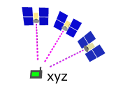
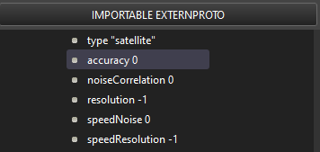
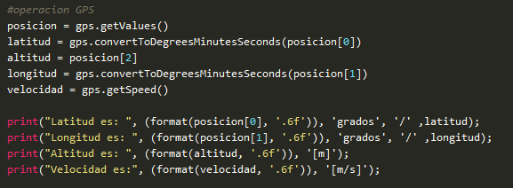
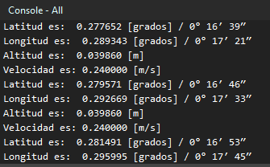

# GPS

El nodo GPS se utiliza para modelar un sensor de posicionamiento global (GPS) que puede obtener información sobre su posición absoluta desde el programa del controlador.

## Forma de uso y configuraciones comunes en WEBOTS

* **type**: Este campo define el tipo de tecnología GPS utilizada como "satélite" o "láser" (actualmente se ignora).
* **accuracy**: Este campo define la precisión del GPS, es decir, la desviación estándar (expresada en metros) del ruido gaussiano añadido a la posición.
* **noiseCorrelation**: El modelo de ruido es entonces aproximado por un fenómeno gaussiano-correlacionado, que captura por ejemplo los fenómenos de deriva presentes en el GPS. El valor debe estar entre 0 y 1 y representa cuánto influye el ruido de hace 1 segundo en el ruido actual, 0 significa que no hay influencia y 1 significa que el ruido será constante. 
* **resolution**: Este campo permite definir la resolución del sensor, la resolución es el cambio más pequeño que es capaz de medir. Establecer este campo a -1 (por defecto) significa que el sensor tiene una resolución "infinita" (puede medir cualquier cambio infinitesimal). Este campo acepta cualquier valor en el intervalo (0.0, inf).
* **speedNoise**: Este campo define la desviación estándar (expresada en metros) del ruido gaussiano añadido a las medidas de velocidad del GPS.
* **speedResolution**: Este campo define la resolución de las mediciones de velocidad, la resolución es el menor cambio de velocidad que el GPS es capaz de medir. Establecer este campo a -1 (por defecto) significa que el sensor tiene una resolución "infinita" (puede medir cualquier cambio infinitesimal). Este campo acepta cualquier valor en el intervalo (0.0, inf).

## Código

 

Con el comando “format ( ‘variable’, ‘.6f’)” se consigue poner 6 decimales para que no salgan tantos por pantalla y así resulte más sencillo de ver.

Lo que sale por la consola indicando en qué posición se encuentra el robot en grados, pasándolo luego a minutos y segundos para darlo con mayor exactitud.

## Diferencias con la realidad

No requieres de conexión a Internet para recibir los datos de los satélites, la posición es más exacta que la obtenida en el gps básico que todos utilizamos, obviamente los hay más potentes y precisos. También añadir que en la simulación, la resolución de la posición es inmediata, en la vida real (por muy rápido que funcione) tardará un tiempo (pequeño, pero existente).

Ni que decir tiene que al simularse, este no tiene coste, mientras que en la realidad si.
 
---