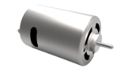
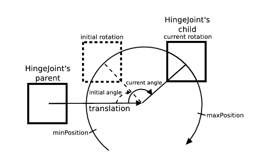
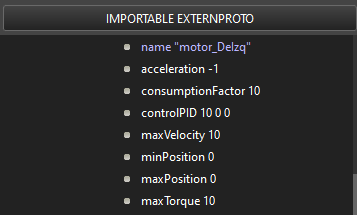
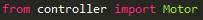
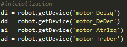
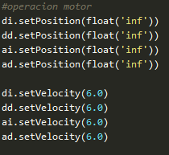

# RotationalMotor

Se puede usar un nodo RotationalMotor para alimentar una HingeJoint o una Hinge2Joint para producir un movimiento de rotación alrededor del eje elegido.

La forma más común de controlar un motor es el control de posición directo (control de posición). El usuario define la posición de destino utilizando la función wb_motor_set_position, luego el controlador P lleva la velocidad, la aceleración y la fuerza requerida del motor a la posición de destino.

Los motores también se pueden usar para controlar la velocidad en lugar de la posición. Esto es facilitado por dos llamadas a la función: en primer lugar se debe llamar a la función wb_motor_set_position con INFINITY (#include <math.h>, usada en python como float(‘+inf’)) ) como parámetro de posición. A continuación, se debe especificar la velocidad deseada, que puede ser positiva o negativa, llamando a la función wb_motor_set_velocity. Esto iniciará un movimiento continuo del motor con la velocidad deseada, teniendo en cuenta la aceleración y la fuerza del motor especificadas.

Si varios motores, ya sea RotationalMotor , LinearMotor o una combinación de ambos, comparten la misma estructura de nombre y pertenecen al mismo Robot, entonces se considera que están acoplados. Cuando se da una orden a un motor acoplado, por ejemplo usando las funciones wb_moto_set_position o wb_motor_set_velocity, el mismo comando se transmite a todos los demás. Aunque cada motor acoplado recibe los mismos comandos, lo que realmente imponen los motores depende de sus propios valores multiplicadores.

## Forma de uso y configuraciones comunes en WEBOTS

* El campo **name**: especifica el identificador de nombre del dispositivo motor. Este es el nombre al que wb_robot_get_device se refiere la función. Por defecto es "rotational motor".
* El campo **maxTorque**: especifica tanto el límite superior como el valor predeterminado para el par disponible del motor y se expresa en newton metro . Cuando se usa en el control de velocidad, este par máximo siempre se aplica hasta que se alcanza la velocidad objetivo. El valor de maxTorque siempre debe ser cero o positivo un pequeño maxTorque.

## Código

## Diferencias con la realidad

Es más común que ocurran fallos de fábrica en la realidad con este componente respecto a otros, y por ello, en la simulación se trabaja en condiciones ideales. La manipulación es más sencilla en la simulación, ya que en la realidad los motores pueden ser muy grandes y pesados.

Ni que decir tiene que al simularse este no tiene coste, mientras que en la realidad si, por lo que se pueden realizar simulaciones extremas que no harías en la vida real.

---
